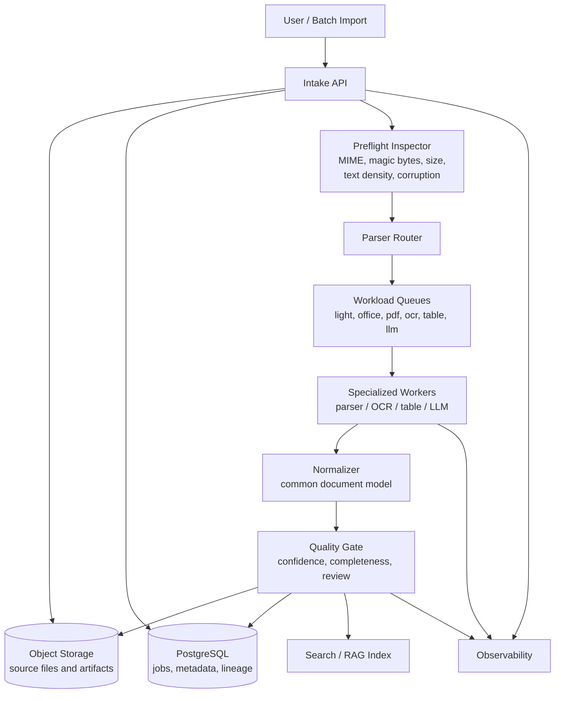

# High-Level Design

## Notes

- Route by document condition, not file extension alone.
- Keep OCR, table, and LLM work isolated from light parsing.
- Store large artifacts in object storage and durable metadata in PostgreSQL.
- Index only verified or policy-approved output.
