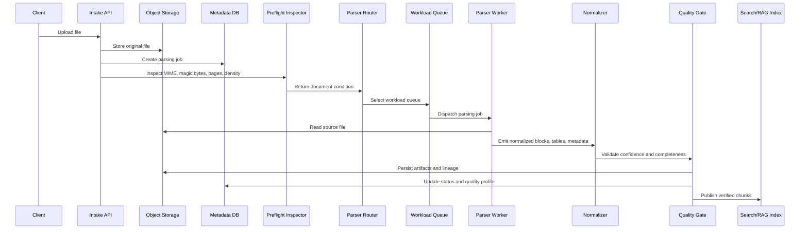

# Low-Level Design

## Key Controls

| Control | Purpose |
| --- | --- |
| Preflight inspection | Prevent wrong parser selection and unsafe files. |
| Workload queues | Isolate fast text jobs from OCR/table-heavy jobs. |
| Normalized model | Give downstream systems one stable output shape. |
| Quality gate | Stop empty or low-confidence extraction from being indexed silently. |
| Lineage metadata | Preserve source hash, parser version, page anchors, and confidence. |
