# Document Intelligence Architecture

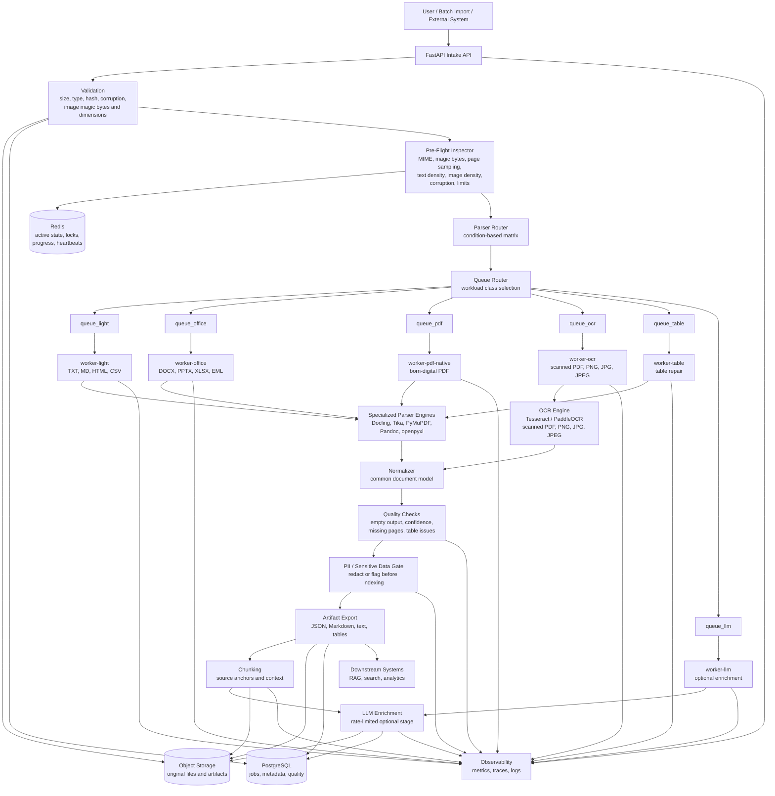

## Flow Summary

1. File is uploaded or imported.
2. Platform validates size, type, hash, basic file health, and image safety checks for PNG/JPEG inputs.
3. Original file is stored and pre-flight inspection samples the document.
4. Router chooses a workload class from document condition, not extension alone.
5. Queue router sends work to light, office, PDF, OCR, or table queues.
6. Specialized workers run only the parser dependencies they need.
7. Output is normalized into a common document model.
8. Quality checks flag incomplete or low-confidence extraction.
9. PII/sensitive-data gates redact or flag content before open search/RAG indexing.
10. Artifacts are exported with source anchors for RAG, search, analytics, and review.
11. Optional LLM enrichment runs through a separate rate-limited queue.

## Compute Tiering

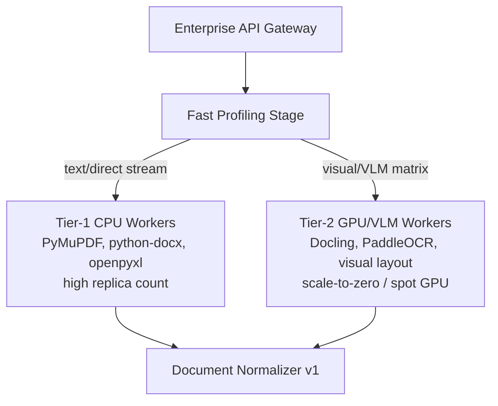

## Storage Ownership

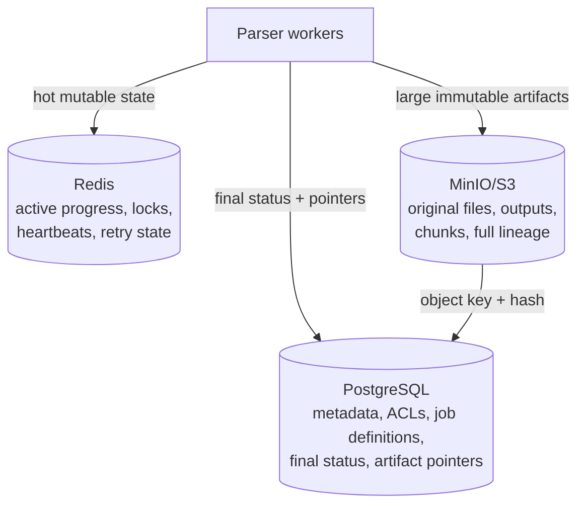

## Quality And Security Gate

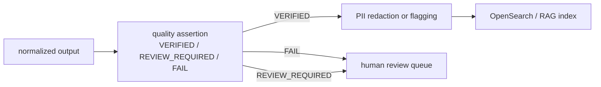

## Worker Isolation

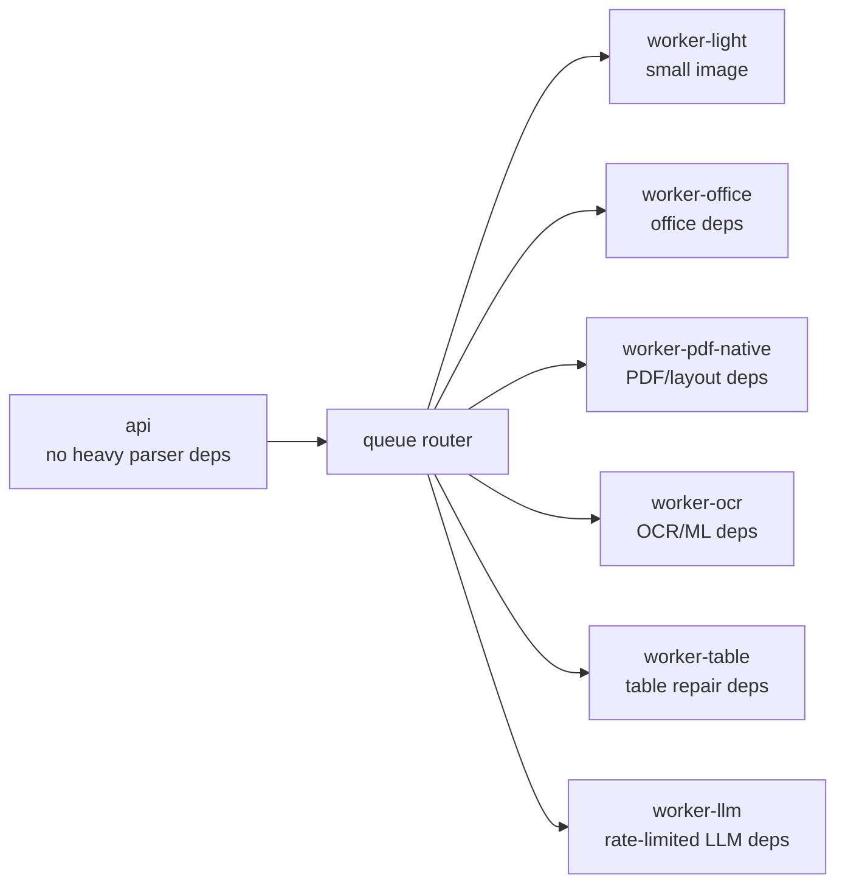

## Queue Isolation

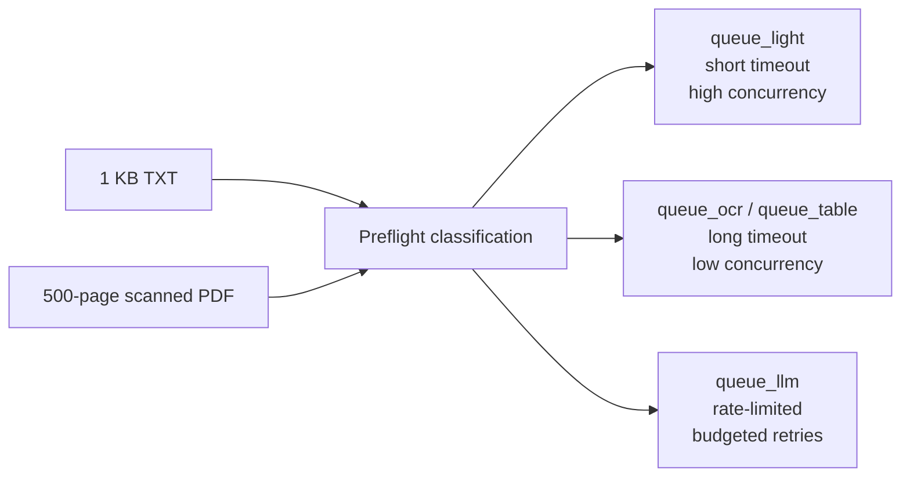

## LLM Isolation

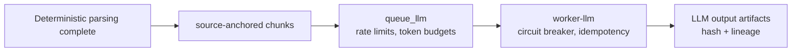

## Idempotent Pipeline Trace

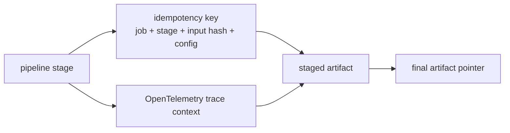

## PDF Preflight Routing

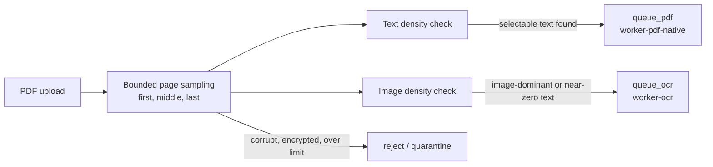

## Image Routing

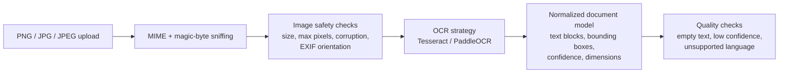

## Table Normalization

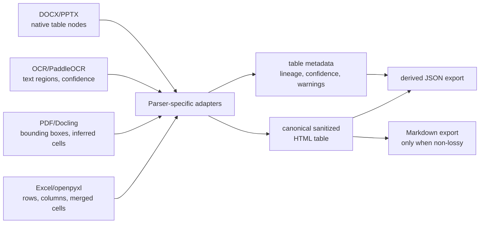
