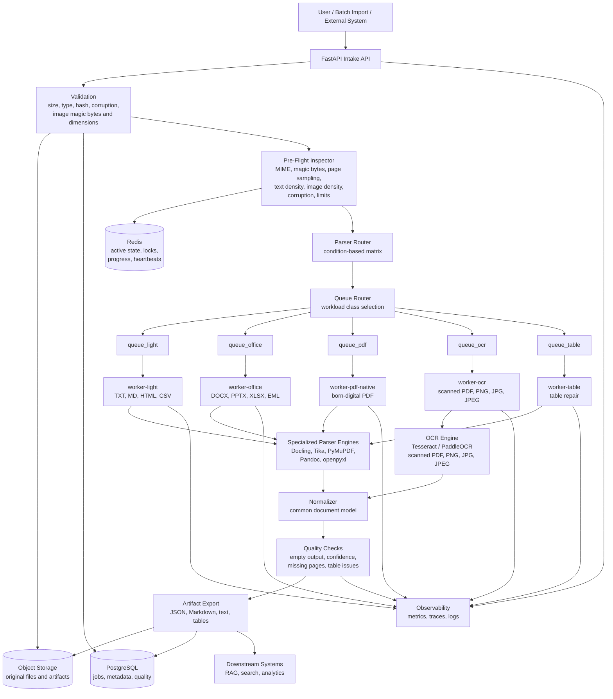
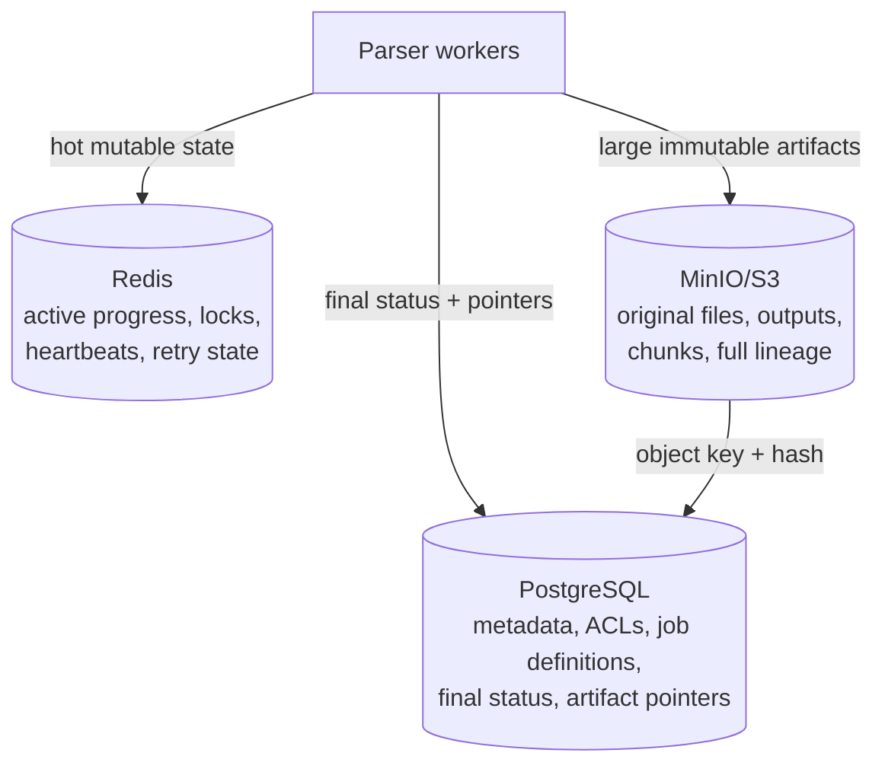
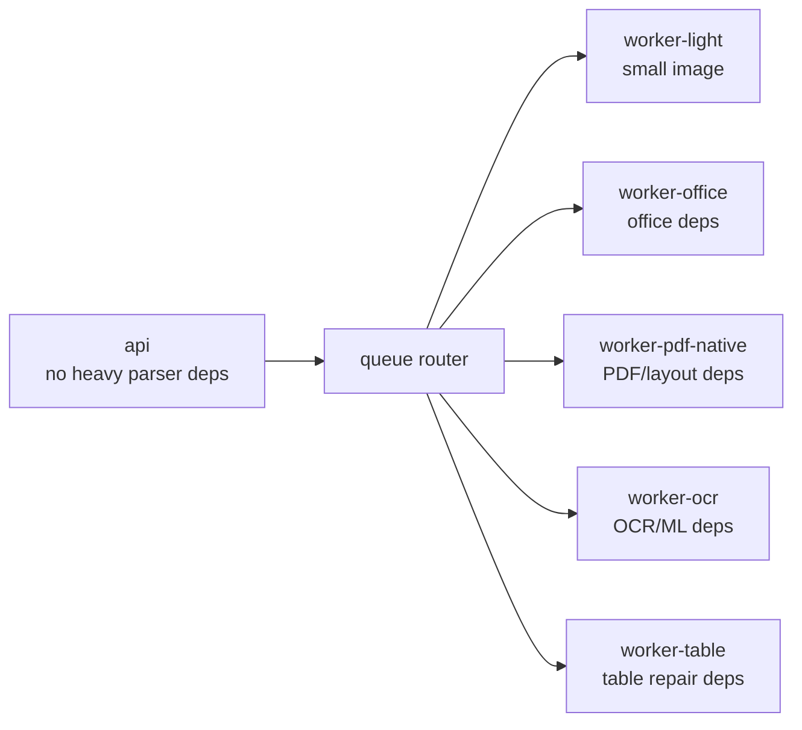
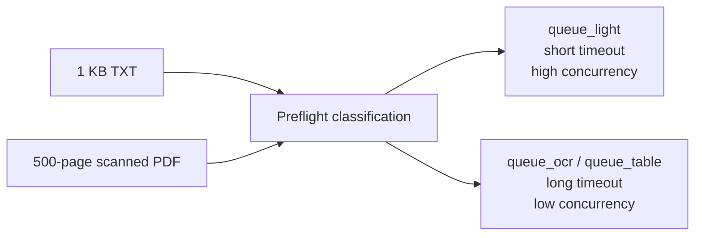
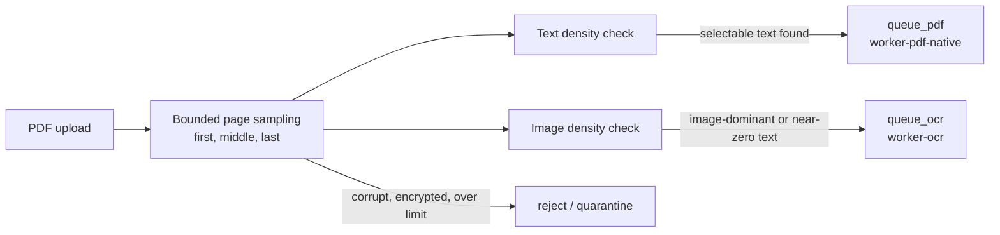
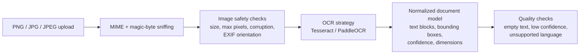
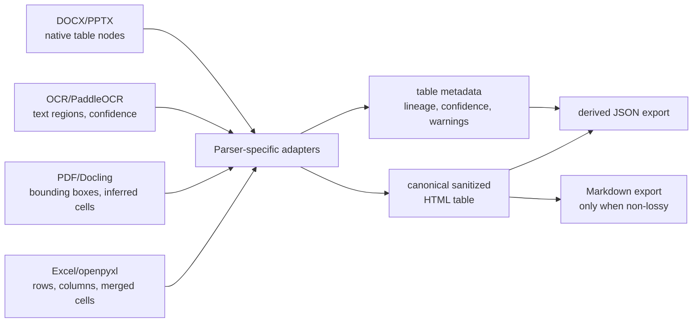

# Document Intelligence Architecture

## Flow Summary

1. File is uploaded or imported.
2. Platform validates size, type, hash, basic file health, and image safety checks for PNG/JPEG inputs.
3. Original file is stored and pre-flight inspection samples the document.
4. Router chooses a workload class from document condition, not extension alone.
5. Queue router sends work to light, office, PDF, OCR, or table queues.
6. Specialized workers run only the parser dependencies they need.
7. Output is normalized into a common document model.
8. Quality checks flag incomplete or low-confidence extraction.
9. Artifacts are exported for RAG, search, analytics, and review.

## Storage Ownership

## Worker Isolation

## Queue Isolation

## PDF Preflight Routing

## Image Routing

## Table Normalization

