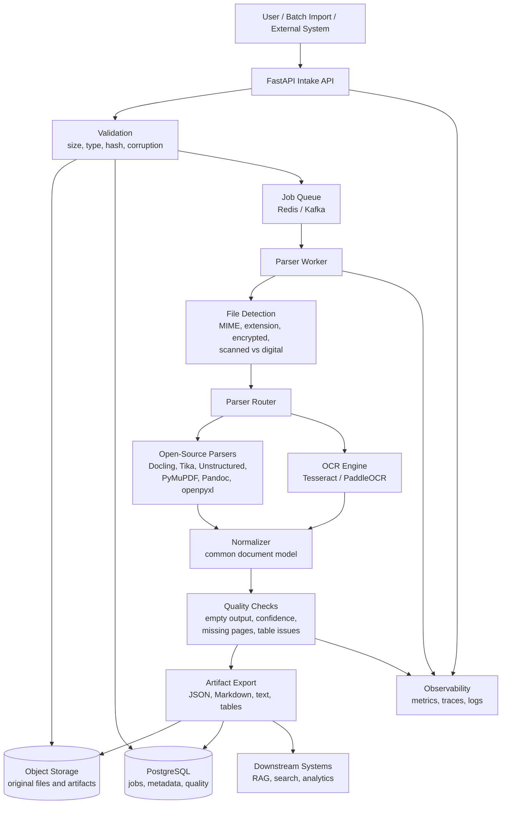

# Document Intelligence Architecture

## Flow Summary

1. File is uploaded or imported.
2. Platform validates size, type, hash, and basic file health.
3. Original file is stored and parse job is queued.
4. Worker detects file type and document condition.
5. Parser router chooses the best open-source parser or OCR path.
6. Output is normalized into a common document model.
7. Quality checks flag incomplete or low-confidence extraction.
8. Artifacts are exported for RAG, search, analytics, and review.

